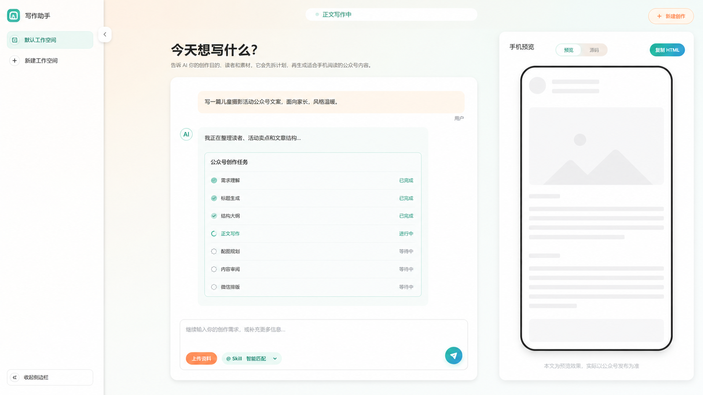
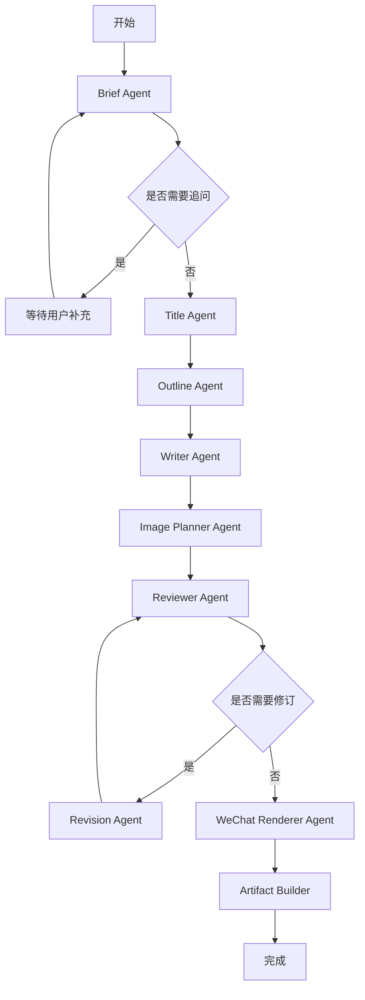

# 规格：LangGraph + BullMQ 多 Agent 公众号创作系统

> 实施状态说明：本文记录最初多 Agent 目标架构。生产化链路以 `docs/specs/006-langgraph-multi-agent-production-completion.md` 为准；Conversation 创建、历史、资源和删除以 `docs/specs/007-conversation-lifecycle-and-resource-ownership.md` 为准。

## 背景

当前系统已经形成“左侧历史会话、中央创作区、右侧手机预览”的交互基础，并具备 `Conversation → Run → RunEvent → Artifact` 的雏形。下一阶段要升级为面向商用的多 Agent 架构，使公众号创作从单 Agent 自动执行变为可恢复、可观测、可扩展的多节点工作流。

本规格承接：

- `docs/adr/003-auto-run-with-clarification-only.md`
- `docs/adr/004-langgraph-bullmq-multi-agent-architecture.md`
- `docs/specs/003-run-event-streaming.md`

## 目标

- 使用 `LangGraph.js` 作为多 Agent 编排引擎。
- 使用 `BullMQ + Redis` 承载生产级任务队列。
- 新增 `apps/worker` 执行 LangGraph，不让长任务阻塞 HTTP 请求。
- 前端中间区域升级为聊天式对话流，任务卡嵌入对话列表。
- 任务进度通过 `RunEvent` SSE 流式展示。
- 用户不确认计划，只在信息不足时追问。
- 最终公众号正文只来自 `Artifact` / `ArticleVersion`，不能混入用户原始输入、执行计划或 Agent 过程。

## 非目标

- 第一阶段不使用 LangGraph Agent Server / Platform 作为主运行时。
- 第一阶段不做 token 级正文流式写入最终文章。
- 第一阶段不开放任意 Agent 自主调用外部工具。
- 第一阶段不把 LangGraph checkpoint 作为业务事实源。
- 第一阶段不直接接入微信公众号发布。

## 交互目标

交互参考图：



### 页面结构

```text
左侧：工作空间栏
中间：对话流 + 多 Agent 任务卡 + 底部输入框
右侧：固定宽度手机预览
```

### 中间对话区

对话区不再是单个大输入框，而是：

- 顶部：当前创作标题和简短说明。
- 中部：消息列表。
- 消息列表中包含用户气泡、AI 可见回复、追问卡和任务卡。
- 底部：固定输入框，包含上传资料、`@ Skill` 和发送按钮。

### 多 Agent 任务卡

任务卡作为对话消息存在，展示：

```text
公众号创作任务
✓ 需求理解
✓ 标题生成
✓ 结构大纲
→ 正文写作
· 配图规划
· 内容审阅
· 微信排版
```

任务完成后自动收起为：

```text
公众号创作任务
已完成 7 个步骤
```

### 追问卡

只有信息不足时才出现追问卡。例如：

```text
还需要补充目标读者
为了更准确地写正文，请告诉我这篇文章主要面向谁？
[家长] [本地消费者] [老客户]
也可以自己输入
```

### 右侧手机预览

手机预览只显示：

- 生成中的文章骨架。
- 最终公众号文章。
- HTML 源码视图。
- 微信兼容检查状态。

手机预览不得显示：

- 用户原始 prompt。
- Agent 执行计划。
- 模型思考过程。
- 审阅报告。
- 内部 prompt。

## 产品对象

```text
Workspace
→ Conversation
  → ConversationMessage
  → ConversationResource
  → Run
    → RunEvent
    → AgentTask
    → AgentOutput
    → Artifact
      → ArticleVersion
```

职责：

| 对象 | 职责 |
| --- | --- |
| `Conversation` | 当前创作上下文。 |
| `ConversationMessage` | 用户和 AI 可见沟通记录。 |
| `ConversationResource` | 当前会话绑定的素材引用。 |
| `Run` | 一次公众号创作任务。 |
| `RunEvent` | 可恢复的前端流式事件。 |
| `AgentTask` | 单个 Agent 节点执行记录。 |
| `AgentOutput` | 单个 Agent 的结构化输出。 |
| `Artifact` | 一次任务输出的产物索引。 |
| `ArticleVersion` | 最终公众号正文事实源。 |

边界规则：

- `ConversationMessage` 不保存模型原始思维链。
- `RunEvent` 不替代 `Run` 和 `Artifact`。
- `AgentOutput` 不直接成为最终公众号内容。
- `ArticleVersion.content_json` 是最终公众号正文事实源。

## 多 Agent 分工

| Agent | 职责 | 输入 | 输出 |
| --- | --- | --- | --- |
| Orchestrator Agent | 推进 LangGraph 状态、写事件、决定下一节点。 | `CreationGraphState` | 更新后的 state |
| Brief Agent | 理解用户需求、素材和目标。 | 消息、资源、Skill | `CreativeBrief` |
| Clarification Agent | 判断是否必须追问。 | `CreativeBrief` | `ClarificationRequest \| null` |
| Title Agent | 生成标题、备选标题和副标题。 | `CreativeBrief` | `TitleCandidates` |
| Outline Agent | 生成公众号结构。 | `CreativeBrief`、标题方向 | `ArticleOutline` |
| Writer Agent | 生成结构化正文草稿。 | Brief、Outline、素材 | `ArticleDraft` |
| Image Planner Agent | 规划封面、正文图和组图。 | Draft、资源 | `ImagePlan` |
| Reviewer Agent | 检查故事性、商业结构、微信阅读体验。 | Draft、Brief、ImagePlan | `ReviewReport` |
| Revision Agent | 根据审阅问题修订草稿。 | Draft、ReviewReport | `ArticleDraft` |
| WeChat Renderer Agent | 生成微信兼容 HTML 和预览结构。 | Final Draft、ImagePlan | `RenderedArticle` |
| Artifact Builder | 校验并保存最终产物。 | RenderedArticle | `Artifact`、`ArticleVersion` |

## LangGraph 主图



## Graph State

```ts
type CreationGraphState = {
  workspaceId: string;
  conversationId: string;
  runId: string;

  userInput: string;
  resourceIds: string[];
  skillId: string;

  brief?: CreativeBrief;
  clarification?: ClarificationRequest;
  titles?: TitleCandidate[];
  outline?: ArticleOutline;
  draft?: ArticleDraft;
  imagePlan?: ImagePlan;
  reviewReports: ReviewReport[];
  finalDocument?: ArticleDocument;
  artifactId?: string;

  revisionCount: number;
  maxRevisionCount: number;
  status: "running" | "waiting_clarification" | "completed" | "failed";
};
```

规则：

- Graph State 由 LangGraph checkpoint 保存。
- 产品侧只读取必要投影，不直接依赖完整 checkpoint。
- 每个节点必须输入/输出结构化 schema。
- 节点失败必须记录 `AgentTask` 和 `run.failed` 或可重试事件。

## 服务边界

```text
浏览器
→ apps/web
→ apps/service
  → PostgreSQL
  → Redis / BullMQ
  → MinIO / S3

apps/worker
→ Redis / BullMQ
→ PostgreSQL
→ Model Gateway
→ MinIO / S3
```

### `apps/service`

职责：

- 提供 Conversation、Run、Artifact API。
- 写入用户消息和资源绑定。
- 创建 Run 并投递 BullMQ job。
- 提供 `GET /runs/:id/events` SSE。
- 提供 Artifact 和 ArticleVersion 查询。
- 校验权限、配额和输入。

不负责：

- 执行长时间模型调用。
- 直接推进 LangGraph 节点。

### `apps/worker`

职责：

- 消费 `creation-run` 队列。
- 执行 LangGraph。
- 写入 AgentTask、AgentOutput、RunEvent、Artifact。
- 调用 Model Gateway。
- 处理节点重试、失败和超时。

不负责：

- 面向浏览器提供 API。
- 校验用户会话权限。

## 队列设计

队列名：

```text
creation-run
```

Job payload：

```ts
type CreationRunJob = {
  runId: string;
  conversationId: string;
  workspaceId: string;
  graphName: "wechat_article_creation";
  graphVersion: string;
};
```

队列规则：

- `jobId` 使用 `runId`，保证创建任务幂等。
- Worker 并发数按模型限流配置。
- 节点可重试，但 Artifact Builder 不允许重复创建最终版本。
- Job 失败后写 `run.failed`，保留可重试入口。

## 数据库新增

### `graph_runs`

保存业务 Run 与 LangGraph 执行实例的关系。

```text
id
run_id
conversation_id
graph_name
graph_version
thread_id
status
started_at
completed_at
failed_at
created_at
updated_at
```

### `agent_tasks`

保存每个 Agent 节点的执行记录。

```text
id
run_id
agent_name
node_name
status
input_ref
output_ref
error_code
error_message
started_at
completed_at
created_at
```

### `agent_outputs`

保存 Agent 的结构化输出。

```text
id
run_id
agent_task_id
type
schema_version
payload_json
created_at
```

输出类型：

```text
creative_brief
clarification_request
title_candidates
article_outline
article_draft
image_plan
review_report
render_result
```

### `run_events`

持久化 SSE 可恢复事件。

```text
id
run_id
event_no
type
payload_json
created_at
```

### LangGraph checkpoint

使用独立 schema：

```text
langgraph.checkpoints
langgraph.checkpoint_writes
langgraph.checkpoint_blobs
```

规则：

- checkpoint 是执行恢复数据，不是产品事实源。
- 业务查询不得直接依赖 checkpoint。
- checkpoint 可按保留策略归档或清理。

## RunEvent 映射

LangGraph 内部节点事件需要转换为产品事件。

| Graph 节点 | RunEvent | 前端表现 |
| --- | --- | --- |
| Brief start | `step.started` | 需求理解中 |
| Brief done | `step.completed` | 需求理解完成 |
| Clarification required | `clarification.required` | 展示追问卡 |
| Title done | `step.completed` | 标题生成完成 |
| Outline done | `step.completed` | 结构大纲完成 |
| Writer running | `step.started` | 正文写作中 |
| ImagePlan done | `step.completed` | 配图规划完成 |
| Review done | `step.completed` | 内容审阅完成 |
| Render done | `step.completed` | 微信排版完成 |
| Artifact created | `artifact.created` | 手机预览更新 |
| Graph done | `run.completed` | 任务卡收起 |

## API 目标

Conversation 生命周期修订后的主 API：

```text
POST /conversations
POST /conversations/:conversationId/turns
GET  /runs/:runId
GET  /runs/:runId/events
GET  /artifacts/:artifactId
```

新增：

```text
POST /runs/:runId/clarifications
GET  /runs/:runId/tasks
GET  /runs/:runId/outputs
```

说明：

- `/clarifications` 用于用户补充必要信息后恢复 Graph。
- `/tasks` 用于调试和后台运营查看 Agent 节点状态。
- `/outputs` 默认不面向普通用户，只给内部排障和审计。
- 首次和后续 Turn 已包含 Message、Resource 关系、Run 和 outbox 原子写入，不再由前端分段调用。

## 最终内容防污染

Artifact Builder 保存前必须校验：

- 只接受 `ArticleDocument` 或等价结构化内容。
- 不接受自然语言计划作为正文。
- 不接受模型思考过程。
- 不接受原始 prompt 大段复述。
- 不接受审阅报告进入正文。

建议加入文本 guard，拦截：

```text
我会
以下是计划
执行步骤
思考过程
根据你的输入
作为 AI
用户要求
审阅发现
```

命中 guard 时：

```text
Artifact Builder 拒绝保存
→ 写 agent_outputs(render_result.invalid)
→ 写 run.failed 或进入 revision
```

## 分阶段落地

### 阶段 1：文档和契约

- 新增本规格、ADR、模块文档、测试文档。
- 定义 Graph State 和 Agent 输出 schema。
- 明确新增数据库表。

### 阶段 2：服务内 LangGraph Spike

- 在 `apps/service` 内新增 `creation-graph` 模块。
- 用现有内存 store 跑通 graph。
- 把 graph event 转成 RunEvent。

### 阶段 3：Worker 和队列

- 新增 `apps/worker`。
- 引入 Redis / BullMQ。
- `POST /runs` 只创建任务并入队。
- Worker 执行 LangGraph 并写事件。

### 阶段 4：持久化

- PostgreSQL 新增 `graph_runs`、`agent_tasks`、`agent_outputs`、`run_events`。
- 接入 LangGraph Postgres checkpointer。
- 页面刷新后恢复 Run、任务卡和预览。

### 阶段 5：前端聊天流

- 中间区域改为消息列表。
- 任务卡作为对话消息展示。
- 追问卡支持快捷选项和自由输入。
- 右侧手机预览只绑定 Artifact。

### 阶段 6：质量和商用能力

- 增加配额、限流、失败重试。
- 增加 Agent 节点观测。
- 增加 artifact guard。
- 增加图片规划和真实素材处理。

## 验收标准

- 用户发送需求后，中间对话区立即出现用户消息。
- Run 创建后任务卡显示在对话列表中。
- 任务卡能通过 SSE 更新多 Agent 进度。
- 不出现“按计划执行”确认按钮。
- 信息不足时出现追问卡。
- 用户补充信息后 Graph 能恢复执行。
- 右侧手机预览只显示最终公众号内容或生成中骨架。
- 最终 Artifact 不包含用户原始输入、执行计划、AI 思考过程或审阅说明。
- Worker 失败时 Run 状态和事件可恢复。
- 页面刷新后可恢复当前 Run、任务进度和最新 Artifact。
