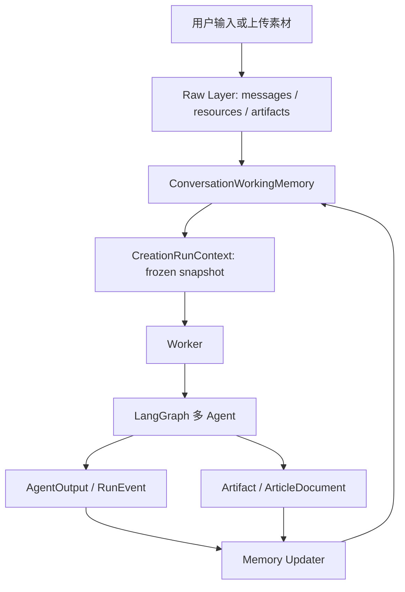
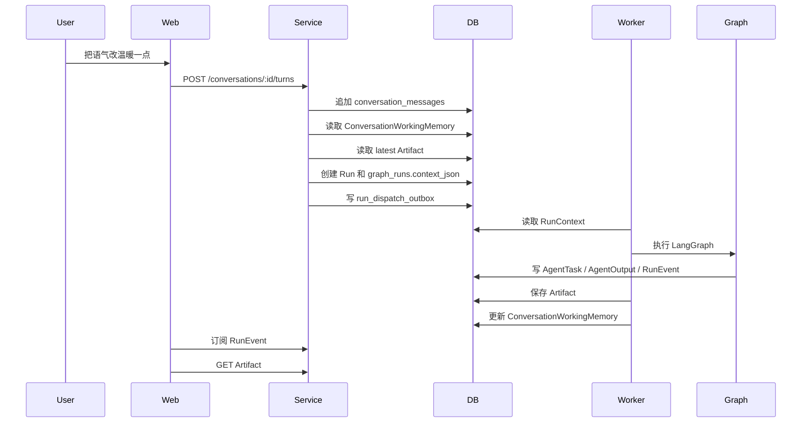

# 规格：公众号会话级上下文管理

## 背景

公众号生成工具的核心使用方式是围绕一个创作会话连续生成、补充、修改和复制 HTML。系统不需要跨会话长期记住用户偏好，但需要在同一个 `Conversation` 内稳定管理用户需求、素材、已生成文章和后续修改意见。

当前系统已经具备 `Conversation`、`Run`、`graph_runs.context_json`、`RunEvent`、`AgentOutput` 和 `Artifact`。本规格在现有基础上增加会话级工作记忆，使后续 Run 能基于当前会话状态继续创作，而不是每次从空白 prompt 重新生成。

## 目标

- 只管理当前 `Conversation` 内的会话记忆，不建立跨会话长期记忆。
- 每次 Run 使用冻结上下文快照，保证执行过程可复现。
- 支持“继续写”“修改标题”“第三段加活动信息”“语气更温暖”等多轮修改。
- 避免把完整历史消息无差别塞入模型上下文。
- 保持 `Artifact` / `ArticleDocument` 作为最终公众号正文事实源。

## 非目标

- 不做跨会话用户画像或品牌长期知识库。
- 不引入向量检索作为第一阶段依赖。
- 不在第一阶段接入 LangGraph 原生 checkpoint。
- 不把历史对话、Agent 过程或审阅报告直接混入最终正文。
- 不把对象存储或 Redis 作为会话记忆事实源。

## 设计原则

1. PostgreSQL 保存会话事实和工作记忆。
2. 原始消息、素材绑定和 Artifact 不可变或只追加。
3. Working Memory 是当前会话的可更新摘要，不替代原始事实。
4. Run 创建时从 Working Memory 生成 `RunContext`，并冻结到 `graph_runs.context_json`。
5. Worker 和 LangGraph 只消费本次 `RunContext`，不直接读取前端临时状态。
6. 每个 Agent 只接收与自身任务相关的上下文片段。

## 上下文分层

```text
Raw Layer
  Conversation、Message、Resource、Artifact 等原始事实。

Working Memory
  当前会话的创作状态摘要，可随用户 Turn 和 Run 结果更新。

Run Context
  本次 Run 的冻结执行快照，保存在 graph_runs.context_json。

Prompt Context
  每个 Agent 调模型前从 Run Context 裁剪出的实际输入。
```

## 总体流程



## Raw Layer

Raw Layer 使用现有事实数据：

```text
conversations
conversation_messages
resources
message_resources
runs
agent_outputs
artifacts
```

Raw Layer 的职责：

- 保存用户完整输入和 Assistant 可见消息。
- 保存资源绑定关系和对象存储引用。
- 保存每次 Run 的结构化输出与最终 Artifact。
- 支持排查、回放和重新构建 Working Memory。

Raw Layer 不直接整体进入模型上下文。

## Working Memory

Working Memory 是当前会话的工作状态摘要。建议新增 `conversation_memories` 表保存。

```ts
interface ConversationWorkingMemory {
  conversationId: string;
  contextVersion: number;
  brief?: CreativeBrief;
  selectedTitle?: {
    id: string;
    title: string;
    subtitle?: string;
    angle?: string;
  };
  outline?: {
    title: string;
    subtitle?: string;
    sectionTitles: string[];
    openingHook?: string;
    callToAction?: string;
  };
  draftSummary?: {
    artifactId?: string;
    title: string;
    paragraphCount: number;
    sectionTitles: string[];
    keyPoints: string[];
    tone?: string;
    audience?: string;
  };
  materialSummary: Array<{
    resourceId: string;
    type: "image" | "document" | "link" | "unknown";
    description: string;
    ocrText?: string;
    suggestedUsage?: string;
    quality?: "high" | "medium" | "low";
  }>;
  userConstraints: string[];
  revisionIntent?: {
    target?: "title" | "outline" | "body" | "image" | "style" | "all";
    instruction: string;
    createdAt: string;
  };
  lastArtifactId?: string;
  updatedAt: string;
}
```

Working Memory 的更新来源：

- 用户新 Turn 中明确表达的约束和修改意图。
- Run 完成后的 `CreativeBrief`、标题、提纲、草稿摘要、配图计划和 Artifact。
- Clarification 提交后的补充信息。
- 素材理解结果或资源摘要。

## Run Context

`CreationRunContext` 由 Service 在创建 Run 时生成，并冻结到 `graph_runs.context_json`。

```ts
interface CreationRunContext {
  userInput: string;
  resourceIds: string[];
  skillId: string;
  maxSteps: number;
  contextVersion: number;
  memory: {
    brief?: CreativeBrief;
    selectedTitle?: ConversationWorkingMemory["selectedTitle"];
    outline?: ConversationWorkingMemory["outline"];
    draftSummary?: ConversationWorkingMemory["draftSummary"];
    materialSummary: ConversationWorkingMemory["materialSummary"];
    userConstraints: string[];
    lastArtifactId?: string;
    revisionIntent?: ConversationWorkingMemory["revisionIntent"];
  };
}
```

规则：

- 同一个 Run 只读取自己的 `context_json`。
- 用户在 Run 执行期间继续发送消息，不改变已经创建的 Run。
- 追问补充会递增 `contextVersion`，更新 `context_json` 后重新入队。
- 如果是修改类请求，Run Context 应包含 `lastArtifactId`，必要时 Worker 可按该 ID 读取上一版 `ArticleDocument`。

## Prompt Context

每个 Agent 从 `RunContext` 中选择必要字段，不接收完整历史。

| Agent | 主要上下文 |
| --- | --- |
| Brief Agent | 最新用户输入、历史 brief 摘要、用户约束、素材摘要 |
| Title Agent | brief、用户约束、上一版标题或修改意图 |
| Outline Agent | brief、selectedTitle、上一版 outline 或结构修改意图 |
| Writer Agent | brief、selectedTitle、outline、修改任务中的上一版 ArticleDocument |
| Image Planner Agent | outline、materialSummary、resourceIds |
| Reviewer Agent | draft、brief、userConstraints、imagePlan |
| Revision Agent | draft、reviewReport、revisionIntent、上一版 Artifact 上下文 |

## Turn 意图

创建 Run 前需要识别当前用户 Turn 的意图。

```ts
type TurnIntent =
  | "new_creation"
  | "revise_existing"
  | "continue_existing"
  | "clarification_answer";
```

第一阶段可使用规则判断：

- 包含“改、调整、换、优化、加、删、重写标题”等动词时，优先判定为 `revise_existing`。
- 当前会话已有 `lastArtifactId` 且用户输入较短时，优先判定为 `revise_existing` 或 `continue_existing`。
- 明确出现“重新生成一篇、新主题、换一个主题”时，判定为 `new_creation`。
- Run 处于 `waiting_clarification` 且提交追问答案时，判定为 `clarification_answer`。

## 数据库建议

第一阶段新增：

```sql
create table conversation_memories (
  conversation_id uuid primary key references conversations(id) on delete cascade,
  context_version integer not null,
  memory_json jsonb not null,
  created_at timestamptz not null default now(),
  updated_at timestamptz not null default now()
);
```

可选二阶段新增：

```sql
create table conversation_memory_versions (
  id uuid primary key,
  conversation_id uuid not null references conversations(id) on delete cascade,
  context_version integer not null,
  memory_json jsonb not null,
  reason text not null,
  created_at timestamptz not null default now()
);
```

`conversation_memory_versions` 仅用于调试和审计，第一阶段不是必需项。

## 多轮修改流程



## 上下文裁剪策略

第一阶段采用固定策略：

- 最新用户输入完整保留。
- 最近 3 条用户消息可选保留；更早消息只进入摘要字段。
- 修改任务按 `lastArtifactId` 读取上一版结构化正文。
- 素材只传 `materialSummary` 和 `resourceIds`，不把原始文件内容重复注入每个 Agent。
- 每个 Agent 只读取自身需要的上下文片段。

禁止：

- 全量历史消息拼接给所有 Agent。
- 把 Agent 执行过程、审阅报告或系统 prompt 写入最终正文。
- 在不同 Conversation 之间共享 Working Memory。

## 与现有模块关系

- `conversations` 负责 Working Memory 的生命周期、Run 创建前的上下文组装、Conversation 删除级联清理。
- `creation-graph` 负责消费冻结的 `RunContext`，并在 Run 完成后输出可用于更新 Working Memory 的结构化结果。
- `assets` 负责资源元数据和素材摘要来源。
- `artifacts` 仍是最终公众号正文事实源。

## 第一阶段实施范围

1. 增加 `ConversationWorkingMemory` 和 `CreationRunContext.memory` 契约。
2. 新增 `conversation_memories` 持久化。
3. 创建 Run 时读取 Working Memory 并冻结到 `graph_runs.context_json`。
4. `CreationGraphState` 支持 `memory`。
5. Run 完成后用 AgentOutput 和 Artifact 更新 Working Memory。
6. 修改类请求读取 `lastArtifactId`，让 Writer 或 Revision Agent 基于上一版内容改写。
7. Clarification 提交后更新 `contextVersion`、`context_json` 和 Working Memory。

## 后续阶段

- 接入素材理解摘要，完善 `materialSummary`。
- 增加上下文调试视图，展示本次 Run 实际使用的上下文摘要。
- 按模型 `contextWindow` 增加 token budget 裁剪。
- 必要时增加 `conversation_memory_versions`。
- LangGraph 原生 checkpoint 仍作为执行恢复增强，不作为业务上下文事实源。

## 验收标准

- 第一轮生成公众号文章后，Working Memory 写入 brief、标题、提纲摘要、正文摘要和 `lastArtifactId`。
- 用户说“标题更吸引人一点”时，系统基于上一版文章修改，不重新空写。
- 用户说“第三段加上活动时间”时，系统能读取上一版结构化正文并定向修改。
- 刷新页面后继续会话，Working Memory 不丢失。
- 新建 Conversation 不继承旧 Conversation 的记忆。
- RunContext 创建后保持冻结，不受后续用户消息影响。
- 最终正文不包含内部上下文、Agent 过程、审阅报告或用户原始长 prompt。

