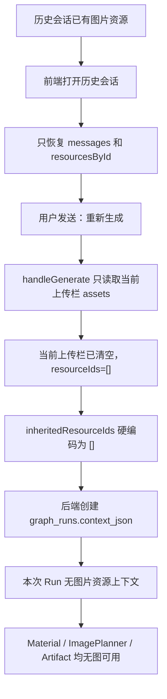
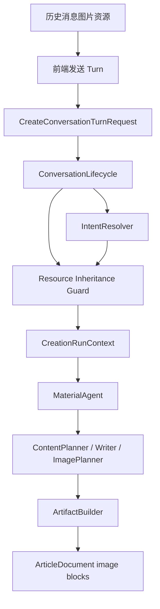

# 规格：会话续写和重新生成的历史图片继承

## 背景

公众号创作是围绕同一个 `Conversation` 连续推进的工作流。用户第一次输入创作需求并上传图片后，后续常见操作包括“继续写”“重新生成”“换个标题”“调整配图”“按刚才的素材再来一版”。这些操作在产品语义上通常仍然属于同一创作主题，应当默认能够使用同一会话内已经上传并绑定的图片资源。

当前系统已经实现了会话文本上下文的 rebuild：前端仍展示完整消息历史，给模型的上下文则由历史 rebuild 加最近有价值的用户输入组成。但图片、文件、二维码等资源不能被文本摘要替代，必须通过 `resourceId`、绑定关系和对象存储原始内容参与后续 Run。

本次生产问题显示：用户在同一会话中发送“重新生成”时，历史消息已经绑定图片，但新 Run 的 `resourceIds`、`currentResourceIds`、`inheritedResourceIds` 和 `resourceContext.materialSummary` 全为空，最终 Artifact 没有任何 image block。因此问题不是模型没有选择图片，而是历史图片没有进入本次 Run 的资源上下文。

## 目标

- 同一 `Conversation` 内，`continue`、`revise` 和由模型判断为同主题的 `auto` Run，应默认继承可用历史图片资源。
- `new` Run 不继承历史资源，避免新主题被旧图片污染。
- 资源继承只传递资源引用和元数据，不压缩、摘要或复制原始图片内容。
- 后端必须作为资源继承的最终可信边界，不能只依赖前端传参。
- 最终 `ArticleDocument` 应尽量使用已规划图片，避免因 Writer 漏填 `assetRefs` 导致已进入 Run 的图片仍无法落入文章。
- 保持前端展示历史和模型上下文机制分离：前端显示完整消息，模型只接收冻结后的 `CreationRunContext`。

## 非目标

- 不做跨 `Conversation` 的图片复用。
- 不建立全局素材库或长期用户素材记忆。
- 不把图片内容转写成唯一事实源。
- 不绕过资源权限校验直接引用对象存储 key。
- 不要求模型判断图片文件是否真实可访问；资源存在性和归属由后端数据库校验。
- 不在本方案内实现 LangGraph 节点级 checkpoint 恢复。

## 当前问题链路



## 设计原则

1. 资源继承以数据库事实为准。`resources.conversation_id`、`message_resources` 和 `conversation_messages.resource_ids_json` 是可继承资源的事实来源。
2. 前端可以提供用户意图和候选继承资源，但后端必须重新校验资源归属、状态和数量上限。
3. `IntentResolver` 决定本轮是否延续同主题。规则只能作为兜底，不能替代模型或结构化意图判断。
4. 文本上下文可以 rebuild；资源上下文不能被 rebuild 成摘要后替代，只能保留 `resourceId`、类型、文件名、已有 material summary 和使用关系。
5. Artifact 生成不能完全依赖某一个 Agent 的图片引用字段。只要 `ImagePlan` 已经规划资源，最终文档应有稳定兜底插入策略。

## 目标数据流



## 前端方案

前端在提交新 Turn 时计算 `inheritedResourceIds`：

- 数据来源：当前会话已加载的用户消息 `message.resourceIds`。
- 资源过滤：只保留 `resourcesById` 中存在，且 `contentType` 为 `image/*` 的资源。
- 去重：排除本轮新上传的 `resourceIds`。
- 数量：最多 30 个，满足 `CreateConversationTurnRequest` 契约。
- 模式：
  - `creationMode === "new"`：传空数组。
  - `creationMode === "continue"`、`"revise"`、`"auto"`：传历史图片候选。

前端职责是“尽量带上候选资源”，不是最终授权。即使前端漏传，后端仍需兜底。

## 后端方案

后端在创建 `CreationRunContext` 前执行资源继承守卫：

1. 解析本轮意图：
   - `new`：不继承历史资源。
   - `continue` / `revise`：允许继承历史资源。
   - `auto`：由 `IntentResolver` 输出的 `creationMode` 决定。
2. 合并资源来源：
   - 本轮新上传 `input.resourceIds`。
   - 前端显式传入 `input.inheritedResourceIds`。
   - 当本轮被判断为同主题且前端未传或传空时，从当前 `Conversation` 历史消息和已 attached 资源中补齐图片资源。
   - `revise` 模式额外保留最新 Artifact 中已使用过的 `artifactResourceIds`。
3. 校验资源：
   - `owner_id` 必须匹配当前用户。
   - `conversation_id` 必须匹配当前会话。
   - `status` 必须为 `attached`。
   - `content_type` 必须为图片类型。
   - 总数不得超过契约上限。
4. 写入 `CreationRunContext`：
   - `resourceIds` 是本轮实际可用资源集合。
   - `currentResourceIds` 只表示本轮新上传资源。
   - `inheritedResourceIds` 表示从历史会话继承的资源。
   - `resourceContext.materialSummary` 包含历史资源已有摘要和本轮资源元数据。

## Artifact 兜底策略

当前 Artifact Builder 只会在 `draft.sections[].assetRefs` 中找到资源引用，并且该引用也存在于 `imagePlan.items[].resourceId` 时插入图片。这个约束过强，容易出现图片已经进入 Run、ImagePlanner 已规划，但 Writer 漏写 `assetRefs`，最终无图的情况。

新增兜底策略：

- 优先级 1：按现有逻辑插入 `draft.sections[].assetRefs` 对应图片。
- 优先级 2：对 `imagePlan.items` 中 `placement === "section"` 且未被插入的图片，按章节顺序插入到对应 section 末尾。
- 优先级 3：对 `placement === "cover"` 且未被插入的图片，插入到 intro 后、第一章前。
- 去重：同一个 `resourceId` 在最终文档中最多出现一次，除非后续明确支持重复使用。
- 不生成虚假 URL，只使用 `/resources/{resourceId}/content`。

## 契约影响

现有 `CreateConversationTurnRequest` 已包含：

```ts
resourceIds: string[]
inheritedResourceIds: string[]
creationMode: "auto" | "new" | "revise" | "continue"
```

本方案不要求新增 API 字段。需要明确语义：

- `resourceIds`：本轮新上传并绑定到当前消息的资源。
- `inheritedResourceIds`：本轮希望继续使用的历史资源候选。
- 后端可以在同主题判断后补齐 `inheritedResourceIds`，并以最终 `CreationRunContext.resourceIds` 作为 Agent 可用资源事实。

## 测试方案

### 前端

- 打开带图片的历史会话后，发送“重新生成”，请求体应包含历史图片 `inheritedResourceIds`。
- `creationMode="new"` 时，请求体不应继承历史图片。
- 本轮新上传图片和历史图片重复时，应去重。

### 后端

- `appendTurn` 在同主题 `continue` 下，即使前端传 `inheritedResourceIds=[]`，也能从历史消息补齐图片资源。
- `appendTurn` 在 `new` 下不继承历史图片。
- 非当前用户、非当前会话、非 `attached` 状态或非图片资源不能被继承。
- `CreationRunContext.resourceContext.materialSummary` 包含继承图片的摘要或元数据。

### Artifact

- `imagePlan` 有 section 图片、draft 有匹配 `assetRefs` 时，按现有逻辑插图。
- `imagePlan` 有 section 图片、draft 缺少 `assetRefs` 时，兜底插图。
- `cover` 图片未被使用时，应插入 intro 后。
- 同一 `resourceId` 不重复插入。

### 生产回归

使用同一会话流程验证：

1. 上传多张图片并生成一次。
2. 不重新上传图片，发送“重新生成”。
3. 新 Run 的 `graph_runs.context_json.resourceIds` 应包含历史图片。
4. 新 Artifact 的 `document.content` 应包含 image block。
5. 预览 HTML 中应出现 `/resources/{resourceId}/content` 图片引用。

## 验收标准

- 同一会话内重新生成时，历史图片默认可进入新 Run。
- 新主题创作不会继承旧图片。
- 前端漏传继承资源时，后端仍能基于同主题判断兜底。
- 最终公众号预览能稳定展示历史图片。
- 所有继承资源均经过 owner、conversation、status 和 content type 校验。
- 新增测试覆盖前端请求、后端上下文和 Artifact 图片落地。

## 风险和取舍

- 自动继承历史图片可能让同一会话中的旧图参与新请求，因此必须依赖 `IntentResolver` 区分 `new` 与同主题继续。
- 如果用户在同一会话中确实想换一组图片，应通过 `creationMode="new"` 或后续显式“不要用之前图片”的意图处理清空继承资源。
- Artifact 兜底会提高“有图可用就落图”的稳定性，但图片位置可能不如模型精细规划，因此只作为兜底，不替代 ImagePlanner。

## 实施顺序

1. 前端补齐 `inheritedResourceIds` 计算和请求体。
2. 后端在创建 RunContext 前增加历史图片继承守卫。
3. Artifact Builder 增加基于 `imagePlan` 的兜底插图。
4. 增加前端、后端和 Artifact 回归测试。
5. 本地验证通过后部署到生产，并用同一会话重新生成场景复测。
