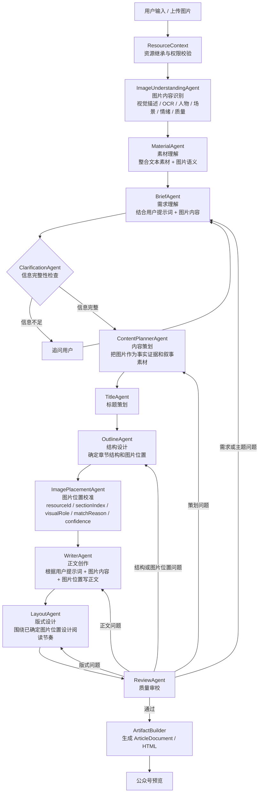
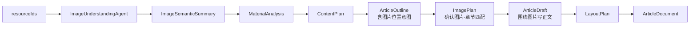

# 规格：基于图片内容的图文策划和自然排版

## 背景

公众号创作中的图片不是排版阶段的装饰物，而是用户提示词的一部分。用户上传的舞台照、证书照、合影、特写、海报等素材，本身携带主题、人物、场景、情绪和事实证据。如果系统在正文写完后才按上传顺序把图片塞入文章，图文关系会显得生硬，容易出现“文字讲获奖，图片却是合影”“章节讲成长，图片却是证书”等错配。

因此图片内容理解必须前置到内容策划之前。内容策划、结构设计和正文创作都应使用图片语义，而不是只在最后排版时使用 `resourceId` 列表。

## 目标

- 图片内容识别在 `ContentPlannerAgent` 之前完成。
- 图片语义作为创作上下文参与需求理解、内容策划、结构设计和正文创作。
- 结构设计阶段确定每张关键图片的大致位置和叙事作用。
- 正文创作阶段基于用户提示词、图片内容、章节结构和图片位置共同写作。
- 排版阶段只负责把已经确定的图文关系视觉化，不再按上传顺序机械填充。
- 低置信度图片允许降级为文末 gallery 或不使用，避免硬塞。

## 非目标

- 不做跨会话图片理解缓存。
- 不把图片识别结果替代原始图片资源。
- 不要求所有上传图片都必须进入文章。
- 不让 LayoutAgent 重新决定文章结构或图片语义匹配。
- 不在本方案内改对象存储、资源权限或上传流程。

## 完整多 Agent 流程



## 数据流



## Agent 职责

### ImageUnderstandingAgent

位置：资源上下文准备之后，内容策划之前。

职责：

- 读取当前 Run 可用图片资源。
- 输出每张图片的结构化语义。
- 不决定文章结构，只描述图片事实和潜在用途。
- 不虚构看不到的内容。

建议输出：

```ts
interface ImageSemanticSummary {
  resourceId: string;
  description: string;
  ocrText?: string;
  subjects: string[];
  scene: string;
  actions: string[];
  mood: string;
  visualTags: string[];
  quality: "high" | "medium" | "low";
  suggestedRoles: Array<"cover" | "fact_proof" | "scene" | "emotion" | "detail" | "ending" | "gallery">;
  riskNotes: string[];
}
```

### MaterialAgent

位置：图片理解之后。

职责：

- 整合用户文本、历史上下文、图片语义和其他素材。
- 输出面向创作的素材摘要。
- 保留 `resourceId`，不得只输出自然语言摘要。

### ContentPlannerAgent

位置：需求理解和信息完整性检查之后。

职责：

- 把图片视为内容证据和叙事素材，而不是装饰。
- 在内容策划中标明每个章节可能使用哪些图片，以及这些图片支撑什么内容。
- 如果图片与主题弱相关，应说明不建议使用。

建议输出中保留：

```ts
sections: Array<{
  heading: string;
  purpose: string;
  keyPoints: string[];
  candidateImageRefs: Array<{
    resourceId: string;
    reason: string;
    role: "cover" | "fact_proof" | "scene" | "emotion" | "detail" | "ending" | "gallery";
  }>;
}>
```

### OutlineAgent

位置：标题之后，正文之前。

职责：

- 确定文章章节结构。
- 初步确定图片位置。
- 让图片位置服务章节叙事，而不是上传顺序。

建议输出中保留：

```ts
imageSlots: Array<{
  resourceId: string;
  sectionIndex?: number;
  placement: "cover" | "section" | "ending" | "gallery";
  narrativePurpose: string;
}>
```

### ImagePlacementAgent

位置：OutlineAgent 之后，WriterAgent 之前。

职责：

- 校准 Outline 中的图片位置。
- 结合图片语义、章节目的、正文待写重点进行匹配打分。
- 输出最终给 Writer 和 Layout 使用的 `ImagePlan`。
- 如果 Outline 已经合理，只补充 `matchReason`、`confidence` 和 `captionHint`。
- 如果图片位置明显错配，应调整 `sectionIndex` 或降级为 gallery。

建议输出：

```ts
interface ImagePlanItem {
  resourceId: string;
  placement: "cover" | "section" | "ending" | "gallery";
  sectionIndex?: number;
  visualRole: "scene" | "people" | "award" | "detail" | "emotion" | "proof" | "brand";
  matchReason: string;
  confidence: number;
  captionHint?: string;
}
```

### WriterAgent

位置：ImagePlacementAgent 之后。

职责：

- 根据用户提示词、Brief、ContentPlan、Outline、图片语义和 ImagePlan 共同创作正文。
- 正文应自然承接图片，而不是写完后等待排版插图。
- 每个章节写作时明确知道该章节对应哪些图片，以及图片承担的叙事功能。
- `assetRefs` 应来自 ImagePlan，而不是自行发明资源 ID。

### LayoutAgent

位置：WriterAgent 之后。

职责：

- 根据已确定的图片位置、正文节奏和视觉角色设计版式。
- 不重新做图片语义匹配。
- 可以调整图片展示形式，例如 full-width、framed、gallery，但不能把图片换到不匹配的章节。

## 匹配规则

图片和章节匹配应按以下维度评分：

- 主题相关度：图片是否直接对应文章主题。
- 章节相关度：图片是否支撑该章节的叙事目的。
- 事实证据：证书、奖杯、海报、现场信息是否适合放在事实说明章节。
- 情绪匹配：笑容、拥抱、舞台状态、训练过程是否适合成长或收束章节。
- 视觉质量：清晰度、主体是否明确、是否适合公众号展示。
- 节奏控制：避免连续相似图片堆叠。
- 信息风险：图片内容不确定或 OCR 不可靠时降低置信度。

## 降级策略

当视觉识别失败或图片语义置信度不足时：

- 保留 `resourceId`，但标记 `quality="low"` 或 `confidence` 较低。
- 不把低置信度图片强塞进核心章节。
- 可以放入文末 gallery。
- 如果全部图片都无法识别，可以回退为上传顺序兜底，但 `matchReason` 必须说明是低置信度兜底。

## 契约影响

需要扩展但不破坏现有契约：

- `MaterialAnalysis.items[]` 增加图片语义字段。
- `ContentPlan.sections[]` 增加候选图片引用。
- `ArticleOutline` 增加图片槽位或图片位置意图。
- `ImagePlan.items[]` 增加 `sectionIndex`、`visualRole`、`matchReason`、`confidence`、`captionHint`。
- `ArticleDraft.sections[].assetRefs` 继续保留，但来源应受 ImagePlan 约束。

## 验收标准

- 图片内容识别结果在 ContentPlan 之前产生。
- ContentPlan 能说明图片如何支撑章节内容。
- Outline 阶段已经有图片位置意图。
- Writer 生成的正文能自然引用或承接对应图片。
- Artifact 不再简单按上传顺序插图。
- 同一组图片乱序上传时，最终图片位置仍由语义匹配决定。
- 视觉识别失败时有明确低置信度降级，不影响整体生成成功。

## 测试方案

### 单元测试

- 三张图片语义：舞台现场、获奖证书、孩子合影。
- 三个章节：获奖事实、舞台表现、成长意义。
- 验证 ImagePlacement 输出不是上传顺序，而是语义匹配：
  - 获奖证书进入获奖事实章节。
  - 舞台现场进入舞台表现章节。
  - 孩子合影进入成长意义或结尾章节。

### 集成测试

- 构造一轮完整 RunContext，包含用户提示词和图片语义。
- 验证 ContentPlan、Outline、ImagePlan、Draft、Artifact 的 `resourceId` 链路一致。
- 验证 `ArticleDocument` image block 的 `sectionIndex` 与 ImagePlan 一致。

### 生产回归

1. 上传多张乱序图片。
2. 输入明确主题生成公众号文章。
3. 检查 Agent 输出中的图片语义、章节匹配原因和置信度。
4. 检查预览中图片位置是否符合章节内容。
5. 重新生成时验证历史图片仍按语义匹配，而不是按上传顺序。

## 实施顺序

1. 扩展 contracts 中图片语义和 ImagePlan 字段。
2. 调整 graph 顺序，把 ImageUnderstanding 放在 ContentPlanner 之前。
3. 修改 ContentPlanner、Outline、Writer 和 Layout 的输入输出契约。
4. 增强 ImagePlacementAgent，让它在正文前输出最终图片位置。
5. 修改 ArtifactBuilder，优先使用 `ImagePlan.sectionIndex` 和 `confidence`。
6. 补充单元测试和集成测试。
7. 生产环境用乱序图片和历史图片重新生成场景复测。
