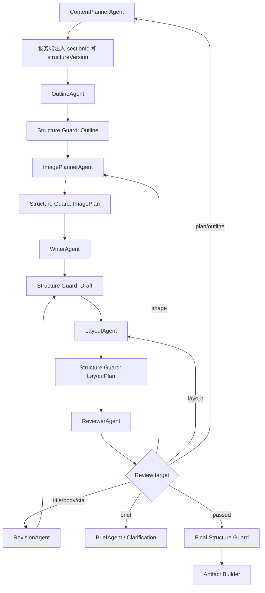

# 规格：多 Agent 稳定章节身份与结构一致性门禁

## 状态

已实施。

## 背景

当前 `ContentPlan`、`ArticleOutline`、`ArticleDraft`、`ImagePlan` 和 `LayoutPlan` 之间主要依靠章节标题与 `sectionIndex` 建立关系。章节标题是可编辑文案，Writer 或 Revision 对标题做自然润色后，即使章节语义、顺序和内容完全不变，也可能在 Artifact Builder 中被 `CONTENT_PLAN_DRIFT` 拒绝。相反，真正的删章、加章、换序、图片错配和旧版式引用只能在链路末端被发现。

生产故障已经证明标题完全相等不是可靠的结构身份：Content Planner 输出“开场：舞台上的那一束光”，Writer 输出“舞台上的那一束光”，最终质量审校通过，但微信排版因字符串不相等失败。

## 目标

- 为跨 Agent 章节建立稳定、不可由文案变化替代的 `sectionId`。
- 使用 `structureVersion` 标记一次完整结构版本，防止新旧计划产物混用。
- 在每个可能改变或引用结构的节点后立即执行确定性门禁。
- 允许章节展示标题自然润色，同时准确阻止删章、加章、换序和非法引用。
- 根据 Review 问题类型返回真正负责的上游节点，不再把所有问题交给 Revision Agent。
- 兼容历史无 `sectionId` 的 AgentOutput，并允许历史会话重新生成。

## 非目标

- 不改变浏览器到服务端的 HTTP API。
- 不新增数据库表或修改现有表结构。
- 不让大模型判断两个章节是否为同一章节。
- 不使用标题语义相似度作为新链路的主身份机制。
- 不允许 Artifact Builder 静默修复真实结构冲突。

## 需求分级与影响面

本需求为 M 级：修改共享契约、AI 编排链路、结构化输出、错误分类和用户可见失败行为，但不改变服务边界，不新增生产依赖，不做数据库 schema 迁移。

影响范围：

- `packages/contracts`：章节引用和结构版本契约。
- `apps/service/creation-graph`：ID 注入、Structure Guard、Review 路由和历史适配。
- Agent prompt：要求引用服务端提供的章节身份，不自行生成身份。
- Artifact Builder：从标题比较改为稳定身份与版本校验。
- Worker 日志和错误摘要：输出可诊断的结构差异。

## 核心模型

### `sectionId`

`ContentPlan` 通过 schema 校验后，由服务端为每个章节生成稳定 `sectionId`。ID 属于系统结构身份，不属于模型创作文案。

规则：

- 同一个 `structureVersion` 内不可修改、重复或复用其他章节的 ID。
- Outline、Draft、ImagePlan、LayoutPlan 和 ArticleDocument 只能引用输入中存在的 ID。
- `heading`、`title` 和其他展示文案可以修改，不改变章节身份。
- 模型漏传或生成未知 ID 时，按契约错误处理，不根据标题猜测。

目标契约：

```ts
interface ContentPlanSection {
  sectionId: string;
  heading: string;
  purpose: string;
}

interface ArticleOutlineSection {
  sectionId: string;
  title: string;
}

interface ArticleDraftSection {
  sectionId: string;
  heading: string;
}

interface ImagePlanItem {
  sectionId?: string;
}

interface LayoutBlock {
  sectionId?: string;
}
```

`sectionIndex` 在兼容期继续保留，用于排序和渲染，但必须由当前章节列表派生，不能再作为跨 Agent 主引用。

### `structureVersion`

`structureVersion` 标识本 Run 中一套相互兼容的章节结构。ContentPlan 首次建立结构时生成版本；合法的增章、删章、拆章、合章或换序必须重新规划并产生新版本。

新版本产生后，旧 Outline、Draft、ImagePlan 和 LayoutPlan 视为过期，必须从最早受影响节点重新生成，不得与新计划拼接。

## 目标流程



## Structure Guard

Structure Guard 是服务端确定性校验，不调用模型。它在 Outline、ImagePlan、Writer、Revision、Layout 和 Artifact 前执行。

至少检查：

| 错误码 | 条件 |
| --- | --- |
| `SECTION_ID_MISSING` | 需要章节身份的输出未携带 `sectionId` |
| `SECTION_ID_DUPLICATED` | 同一输出重复使用章节身份 |
| `SECTION_SET_MISMATCH` | Draft 或 Outline 的章节集合与当前结构不一致 |
| `SECTION_ORDER_DRIFT` | 不允许换序的节点改变了章节顺序 |
| `SECTION_REFERENCE_INVALID` | 图片或版式引用未知章节 |
| `STRUCTURE_VERSION_STALE` | 输出属于过期结构版本 |

Writer 和 Revision 可以修改 `heading`、正文、强调语和 CTA，但不得增删、换序章节，也不得修改 `sectionId`。标题变化本身不是结构错误。

## 模型输出纠错

模型输出缺少、重复或篡改章节 ID 时：

1. schema 或 Structure Guard 立即返回具体差异。
2. Model Gateway 使用允许的 `sectionId` 列表、当前 `structureVersion` 和错误码做一次结构化纠错重试。
3. 重试成功后继续当前节点；重试失败则结束该节点。
4. 不得由 Artifact Builder 使用标题模糊匹配后静默放行。

业务内容错误与模型格式错误分开计数。纠错重试不等同于 Review Revision，不消耗内容修订轮次。

## Review 定向回退

ReviewIssue 按 `target` 路由：

| `target` | 回退节点 | 规则 |
| --- | --- | --- |
| `title` | Title Agent | 更新候选与 `selectedId`，下游使用新标题 |
| `body` / `cta` | Revision Agent | 不得改变章节集合、顺序和身份 |
| `image` | Image Planner | 重新规划章节图片引用 |
| `layout` | Layout Agent | 只调整受控版式，不改变图片语义归属 |
| `plan` / `outline` | Content Planner | 若改变结构，生成新 `structureVersion` 并重跑全部下游节点 |
| `brief` | Brief Agent 或 Clarification | 重新确认主题或必要信息 |

多个问题同时出现时，从最上游受影响节点开始重新执行，避免部分修订覆盖另一类问题。

## Artifact Builder 最终门禁

Artifact Builder 继续作为发布前最后防线，但不再首次发现普通跨节点结构错误。最终校验包括：

- 章节 ID 集合、顺序和结构版本一致。
- 图片与版式只引用有效章节和有效资源。
- 标题来源、主题覆盖、提示词泄漏、Skill 资源与二维码位置合法。
- ArticleDocument 的 heading 和 image attrs 写入 `sectionId`，`sectionIndex` 只作为派生展示信息。

旧 `CONTENT_PLAN_DRIFT` 不再由标题不相等触发。新链路使用细分结构错误码；兼容期只为历史数据保留该错误码映射。

## 历史兼容

历史 `agent_outputs.payload_json` 没有 `sectionId` 和 `structureVersion`。读取历史输出时使用只读适配器：

- 依据 `runId + ContentPlan章节序号` 派生稳定历史 ID。
- 章节数量一致、索引有效时，按旧 `sectionIndex` 映射 Outline、Draft、ImagePlan 和 LayoutPlan。
- 展示标题差异只记录兼容 warning，不阻止重新生成。
- 数量不一致、引用越界或无法建立一一映射时，不猜测身份；从最早受影响节点重新执行。
- 不回写历史快照，不修改已发布 ArticleVersion。

新 Run 必须使用新 schema version。历史会话重新生成时使用当前契约，无需新建 Conversation。

## 过渡期止血

完整契约落地前，可在旧校验中增加标题归一化兼容：去除“开场、回望、绽放、向前”等展示前缀及标点后再比较，并记录 `LEGACY_HEADING_NORMALIZED` warning。

该规则只用于旧 schema 和历史输出，不得成为新 Run 的章节身份策略，也不得掩盖章节数量、顺序和引用差异。

## 可观测性与用户错误

结构门禁失败日志至少记录：

```text
runId
nodeName
structureVersion
violationCode
expectedSectionIds
actualSectionIds
affectedSectionId
```

不得记录完整 prompt、模型思维链、密钥或未脱敏用户正文。用户侧显示安全且具体的摘要，例如“正文章节结构与内容计划不一致，系统未生成发布预览”，后台保留结构差异。

建议指标：

- 各节点结构校验失败率。
- 模型结构纠错成功率。
- Review 按 target 的回退次数。
- Artifact 阶段首次发现结构错误的比例；目标应接近零。
- 历史适配成功率和需要重跑的比例。

## 实施阶段

1. 兼容止血：旧标题归一化、细化日志和回归测试。
2. 契约升级：引入 `sectionId`、`structureVersion` 和 schema version。
3. ID 注入：ContentPlan 校验后由服务端生成身份。
4. 下游贯穿：Outline、ImagePlan、Draft、LayoutPlan 和 ArticleDocument 引用稳定身份。
5. 阶段门禁：在各结构节点后增加 Structure Guard 和一次模型纠错。
6. 定向路由：按 Review target 回退到真正责任节点。
7. 历史适配：只读映射旧输出，无法可靠映射时重跑。
8. 观测收敛：确认 Artifact 首次发现结构错误率达到目标后，移除新 Run 的标题兼容路径。

## 验收标准

- “开场：舞台上的那一束光”改为“舞台上的那一束光”时正常生成 Artifact。
- Writer 或 Revision 修改章节展示标题后，图片和版式仍引用同一 `sectionId`。
- Writer 或 Revision 增章、删章、换序或篡改 ID 时，在该节点后立即失败或纠错，不进入 Artifact。
- ImagePlan 和 LayoutPlan 引用未知章节时返回 `SECTION_REFERENCE_INVALID`。
- 合法结构重规划后 `structureVersion` 变化，旧下游产物不得复用。
- Review 的图片、版式、结构问题分别回到 Image Planner、Layout Agent 和 Content Planner。
- 历史会话可直接重新生成；无法可靠适配时自动重跑受影响节点，不要求创建新会话。
- Artifact 阶段不再因纯标题润色触发 `CONTENT_PLAN_DRIFT`。

## 文档路由

- ADR：`docs/adr/013-stable-section-identity.md`
- 模块：`docs/modules/creation-graph/README.md`
- 测试计划：`docs/testing/plans/creation-graph.md`
- 测试用例：`docs/testing/cases/creation-graph.md`
